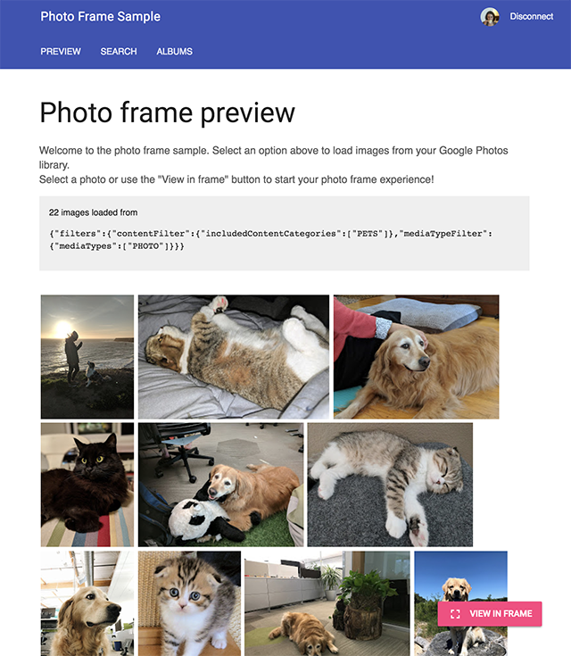
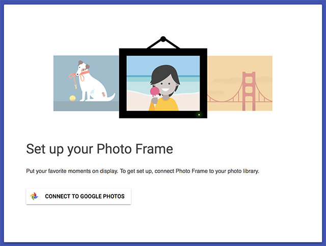

# Photo Frame Sample

This is a Node.js sample application for the [Google Photos Library API](https://developers.google.com/photos).

This sample shows how to connect an app with Google Photos through OAuth 2.0 and display a user's photos and albums in an "online photo frame".

This app is built using [Express.js](https://expressjs.com/) and [Material Design Lite](https://getmdl.io/).

## App Overview
This web app is an online photo frame that allows users to load photos from a search, an album or the library and then show these images in a full screen slideshow.

## Screenshots



## Set up
Before you can run this sample, you must set up a Google Developers project and configure authentication credentials. Follow the
[get started guide](https://developers.google.com/photos/library/guides/get-started) to complete these steps:
1. Set up a Google Developers Project and enable the **Google Photos Library API**.
1. In your project, set up new OAuth credentials for a web server application. Set the authorized JavaScript origin to `http://127.0.0.1` and the authorized redirect URL to `http://127.0.0.1:8080/auth/google/callback` if you are running the app locally.
1. The console will display your authentication credentials. Add the `Client ID` and `Client secret` to the file `config.js`, replacing the placeholder values:
```
// The OAuth client ID from the Google Developers console.
config.oAuthClientID = 'ADD YOUR CLIENT ID';

// The OAuth client secret from the Google Developers console.
config.oAuthclientSecret = 'ADD YOUR CLIENT SECRET';
```

You are now ready to run the sample:
1. Ensure [Node.JS](https://nodejs.org/) and [npm](https://www.npmjs.com/) are installed and available on your system. You need Node.js v7.8.0 or later to run this sample.
1. Navigate to the directory of this sample: `REST/PhotoFrame`.
1. Install dependencies: Run `npm install`,
1. Start the app: Run `node app.js`.

By default, the app will listen on port `8080`. Open a web browser and navigate to [http://127.0.0.1:8080](http://127.0.0.1:8080) to access the app.

# Troubleshooting
Make sure that you have configured the `Client ID` and the `Client secret` in the configuration file `config.js`.
Also check that the URLs configured for these credentials match how you access the server. By default this is configured for 127.0.0.1 (localhost) on port 8080.

You can also start the app with additional debug logging by setting the `DEBUG` environment variable to `true`. For example:
```
DEBUG=TRUE node app.js
```

# API Use and code overview
The app is built using the [Express.js](https://expressjs.com/) framework and the [ejs](http://ejs.co/) templating system.

First, the user has to log in via OAuth 2.0 and authorize the `https://www.googleapis.com/auth/photoslibrary.readonly` scope. (See the file `config.js`.)
Once authenticated, photos are loaded into the photo frame via search or from an album.

The app is split into the backend (`app.js`) and the front end (`static/...`). The photo frame preview screen make AJAX requests to the backend to load a list of selected photos. Likewise, the album screen makes an AJAX request to the backend to load the list of albums that are owned by the user. The backend returns media items or albums directly from the Library API that are parsed and rendered in the browser.

## Search
The search screen (`/search`) is loaded from a template file located at `views/pages/search.ejs` that contains the search form.
When this form is submitted, the POST request is received in `app.js` in the handler `app.post('/loadFromSearch', ...)`. The values sent in the form are used to prepare a [filter] object that is then submitted to the Google Photos Library API `/search` endpoint in `libraryApiSearch(authToken, parameters)`.

The call to the API in `libraryApiSearch(authToken, parameters)` shows how to handle the `nextPageToken` to retrieve multiple pages of search results.

## Albums
The album screen (`/album`)  is loaded from a template file located at `views/pages/album.ejs`. When this screen is loaded, the browser makes a request to `/getAlbums` that is received by the server `app.js` in the handler `app.get('/getAlbums', ...)`.
The method `libraryApiGetAlbums(authToken)` is called to load the albums from the API. This method shows to handle the `nextPageToken` to retrieve a complete list of all albums owned by the user.

The retrieved [`albums`] are returned and displayed through the file `static/js/album.js`. Here the `album` objects are parsed and the title, cover photo and number of items are rendered on screen.

When an album is selected, the handler `app.post('/loadFromAlbum', ...)` receives the id of the album that was picked. Here, a search parameter is constructed and passed to `libraryApiSearch(authToken, parameters)` to load the images.

## Displaying photos
Photos are displayed on the photo frame page of this app. The template file is located at `views/pages/frame.ejs`. When this page is loaded, a request is made to `app.get('/getQueue', ...)` to the server `app.js`.

This handler returns a list of the `mediaItems` the user has loaded into the frame through search or from an album. They are rendered for display by the browser through the file `static/js/frame.js`. Here the caption is constructed from the description and other media metadata. A thumbnail, scaled based on the original height and width, is used to render a preview initially while the image at full resolution is being loaded.